# 每天进步一点点,赢在别人休息时!

我的答案可能不是那么准确,如过各位伙伴有更好的答案,欢迎批评指正,欢迎大家提issues!

####  什么是闭包?

`我的答案是:`闭包其实就是作用域内的函数,就是链接内部函数和外部函数之间的桥梁.

`闭包的官方解释是：  闭包是指有权访问另一个函数作用域中的变量的函数。`

####  js为什么是单线程的?

`我的答案是:`js最初设计的时候,就是做浏览器页面交互的,如果是多线程的,可能存在同一时间,两个进程同时操作同一个dom的情况,一个操作对这个dom进行编辑,另一个进程同时进行删除,同时下发两个指令,那么浏览器应该怎么操作,听谁的?
[链接](https://www.cnblogs.com/langzianan/p/8403330.html)
####  当一个页面数据比较多的时候,出现滚动条的时候,你怎么优化这个页面?
`我的答案是:`面试官的答案是:当页面数据比较多会出现滚轮的时候,你要考虑的是,当用户滚动滚轮,你应该想得到,哪些数据我要立马向后台请求过来的,或者说提前缓存过来的,哪些事件需要立刻绑定上去的,以及对于已经滚动出去的页面,怎样清理内存空间,取消绑定事件等操作.
我的答案是:把多个http请求归纳为一个,以便减少通讯消耗的时间.重写请求数据的方法,去除无用的操作;分发异步执行多个任务,然后统一返回,去除同步执行代码消耗的时间;对于一些耗时较长的逻辑加缓存;
总结:请求优化,资源优化,以及缓存;

####  CSS选择符有哪些?哪些属性可以继承?优先级算法如何计算?内联和!important哪个优先级高?
`我的答案是:`通用(`*`),id(#),类别(.),标签(tag),后代(>),子代(div p),群组(ul,ul),相邻同胞(p+span),伪类(a:hover),属性([attr]);

####  行内元素有哪些？块级元素有哪些？ 空(void)元素有那些?
`我的答案是:`行内元素有 a b i input img label textarea span strong  select;
块级元素:div dir dl form h1-h6 hr menu ol ul p
空元素:br hr input img link meta
继承:css继承一般是指文本方面的继承 ,盒子模型相关的基本上没有继承的;
块级元素可以继承的:text-indent;text-aline;行级别元素可以继承的:lettter-spacing,world-spacing,line-height,color,font相关
####  什么是doctype?
`我的答案是:`百度百科:doctype标签是一种标准通用标记语言的文档类型申明,它的目的是告诉通用标准语言解析器,它应该使用什么样的文档类型定义来解析文档.
####  至少写2种css hack
`我的答案是:`只有IE6能识别的`_`例如:`_background-color:red;`;`*`IE6和IE7能识别,IE8和Firefox不能识别;

         lt   小于
    　　 gt　 大于
    　　 gte  大于或等于
    　　 lte  小于或等于
    　　 ！   非

1.条件hack:

    <!--[if lt IE 7]>    // 小于IE7的
    html代码
    <![endif]-->

2.属性级别的hack:

      #test{
        color:#c30; /* For Firefox */
        color:red\0; /* For Opera */
        color:yellow\9; /* For IE8+ */
        *color:blue; /* For IE7 */
        _color:#ccc; /* For IE6 */
      }

3.选择符级别的hack

`*` html .test{
  color:red;   /* For IE6 and earlier */
}

`*` `+` html `.`test{
  color:red;  // For IE7
}
.test:lang(zh-cn){
  color:red;  // for IE8+ and not IE
}
.test:nth-child(1){
  color:red;  // for IE9+ and not IE
}
**

####  如何让一个div水平垂直居中?

      

        

      

css:

`方法一`     // div绝对定位水平垂直居中【margin:auto实现绝对定位元素的居中】

        .outer{
          width:300px;
          height:300px;
          position:relative;
          overflow:auto
        }
        .inner{
          width:130px;
          height:130px;
          position:absolute;
          maigin:auto;
          top:0;
          right:0;
          left:0;
          bottom:0;
        }

`方法二`  // 不支持IE

        .outer {
          width:300px;
          height:300px;
          background-color: blueviolet;
          display:flex;
        }
        .inner {
          width:120px;
          height:120px;
          background-color: aquamarine;
          margin:auto;
          flex:0 0 auto;
        }

`方案三`   div绝对定位水平垂直居中【margin 负间距】

    .outer {
         width: 300px;
         height: 300px;
         background-color: blueviolet;
         position: relative;
     }

     .inner {
         height: 120px;
         width: 120px;
         background-color: aquamarine;
         position: absolute;
         left: 50%;
         top: 50%;
         margin-top: -60px;
         margin-left: -60px;
     }

`方案四`  // div绝对定位水平垂直居中【Transforms 变形】

    .outer {
         width: 300px;
         height: 300px;
         background-color: blueviolet;
         position: relative;
     }

     .inner {
         height: 120px;
         width: 120px;
         background-color: aquamarine;
         position: absolute;
         left: 50%;
         top: 50%;
         transform: translate(-50%, -50%)
     }

`方案五`

      .outer {
          width: 300px;
          height: 300px;
          background-color: rgb(43, 198, 226);
          display: flex;
          justify-content: center;
          align-items: center;
      }

      .inner {
          height: 120px;
          width: 120px;
          background-color: rgb(40, 119, 109);
      }

`方案六`  //  支持IE

    .outer {
          width: 300px;
          height: 300px;
          background-color: rgb(43, 198, 226);
          display: table-cell;
          text-align: center;
          vertical-align: middle;
      }

      .inner {
          display: inline-block;
          height: 120px;
          width: 120px;
          background-color: rgb(63, 19, 221);
      }

`方法七`

    .outer {
        position: relative;
        border: 1px solid rgb(240, 14, 82);
        width: 400px;
        height: 160px;
    }

    .inner {
        position: absolute;
        width: 200px;
        height: 50px;
        border: 1px solid rgb(24, 13, 177);
        left: -webkit-calc((400px - 200px)/2);
        top: -webkit-calc((160px - 50px)/2);
        left: -moz-calc((400px - 200px)/2);
        top: -moz-calc((160px - 50px)/2);
        left: calc((400px - 200px)/2);
        top: calc((160px - 50px)/2)
    }

####  以下代码执行后,弹窗中依次弹出的内容是什么?请说明为什么?
          +
          function () {
            alert(a)
            a()
            var a = function () {
                console.log('1')
            }

            function a() {
                console.log('2')
            }
            alert(a)
            a()
            var d = c = a
          }()
          alert(d)
          alert(c)

`我的答案是:`考察闭包和变量的提升的,依次出现的内容是:

==> function a (){
  console.log('2')
}

==> 2

==> function (){
  console.log('1')
}

==> 1

==> VM49:16 Uncaught ReferenceError: d is not defined
    at <anonymous>:16:17

`注意`:其中变量c是全局变量,若将alert(d)注释掉,alert(c)将会打印出函数1

#### 以下代码有什么问题,请说出改进的方法?

    for (var i = 0; i < 10; i++) {
        document.body.innerHTML += '<li></li>'
    }

`我的答案是:`

    var html = ''
    for (var i = 0; i < 10; i++) {
        html += '<li></li>'
    }
    document.body.innerHTML = html

或者

      var oFragment = document.createDocumentFragment()
      for (var i = 0; i < 10; i++) {
          html += '<li></li>'
      }
      document.body.innerHTML = oFragment

####  回流和重绘技巧

以下代码执行的时候只会回流2次,当然这个是在操作样式的时候.

     var box = document.getElementsByClassName('box')[0],
    boxStyle = box.style;   // 先用变量保存一次,避免多次操作样式,优化技巧.
    像操作 width height,offset ,client ,scroll,等可以先用变量保存,下次同样操作的时候,系统会直接用变量.
    特别是在做动画或者定时器的时候,要用position:absolute;将动画脱离文档流.避免在每次动画执行的时候,
    尽量避免操作margin-top,否则会影响父级标签,都会执行一次回流和重绘产生的性能问题.
    box.onmoseover = function(){
      boxSty.display = 'none';
      boxSty.border = '5px solid #ccc';
      boxSty.weigh = '50px';
      boxSty.height = '50px';
      boxSty.display = 'block';
    }

####  异步加载的方法?

在script标签中:

    (function (){
      function ascyncLoad(){
      var script = document.createElement('script'),
      firstScript =  document.getElementsByTagName('script')[0];
        script.type = 'text/javascript';
        script.src = './util.js';
        script.async = true;
        firstScript.parentNode.insertBefore(script,firstScript);
      }
      if (script.attachEvent) {
        window.attachEvent('onload',ascyncLoad)
      } else {
        window.addEventListener('onload',asyncLoad,true)
      }
    })()

#### 什么是CDN,请说明使用CDN的好处?
`答案:`CDN的全称是 content delivery network 内容分发网络.

`优势在于:`

(1)解决了夸运营商和夸地域访问的问题,使得访问延迟大大降低;

(2)大部分请求内容在CDN内容边缘完成,CDN起到了分流的作用,减轻了源站的负载.

####  css是什么?css盒子模型有哪些属性?

`我的答案是:`:css中文叫做层叠样式表,盒子模型分为IE模型和标准w3模型两种,W3盒子模型中的属性width,height 不包括:border和padding,而IE盒子模型中的width和height包括了 border和padding

`box-sizing`相关:

    标准w3盒模型: content-box
    IE盒模型:border-box

####  你开发的项目一般是在哪个浏览器上,他们的内核是什么?你是如何优化的?

`我的答案是:`一般是在chrome和IE浏览器上比较多;

      IE浏览器 内核 : trident  -ms- ;
      Firefox 内核 : gecko    -moz- ;
      Safari 内核 : webkit    -webkit- ;
      Opera  内核 : Blink     -o- ;
      Chrome 内核 : Blink    -webkit- ;

####  px和em的区别?

### 基本类型和引用类型的区别简单介绍
####  js typeof 的值有哪些?
`我的答案是:`undefined, boolean, string, number, symbol,function ,object,

基本类型有6种基本类型,undefined,null,string,number,boolean,symbol,

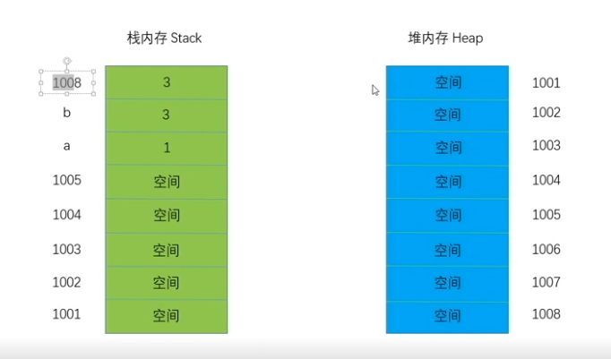

      var a = 3;
      var b = a;
      a = 1;

####  字符串为什么是不可变的?

    当第一步var a = 3的时候,将地址中的1008改为a,然后存放3进去,之后var b = 3也是类似的
    当再次赋值 a = 1 的时候,并不是将之前的1008地址覆盖了,而是将a从新放入1006的地址位置,然后放如1,
    然后地址1008又返回为之前的了,但是其中的存放的值3 还是不变的,所以字符串是不变的的;

#### 简单说下内存中的堆和栈?
    var arr1 = [1,2,3,4];
    var arr2 = arr1; // 在栈内存中开辟一块空间,存放的是堆内存的地址,指向对应的堆内存.
    arr1.push(5);  // 此时的数组 arr1 和arr2 中都是[1,2,3,4,5],因为他们都指向同一个地址.

如图所示:
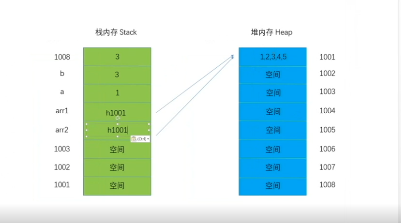

    var arr1 = [1,2,3,4];
    var arr2 = arr1; // 在栈内存中开辟一块空间,存放的是堆内存的地址,指向对应的堆内存.
    arr1.push(5);  // 此时的数组 arr1 和arr2 中都是[1,2,3,4,5],因为他们都指向同一个地址
    arr1 = [1,2];  //这个时候,改变arr1的值,那么在栈内存中(地址为1003)又会重新开启一个新空间
    用于存放arr1,存放的是堆内存的地址,将指针指向新的栈内存空间;

如图所示:

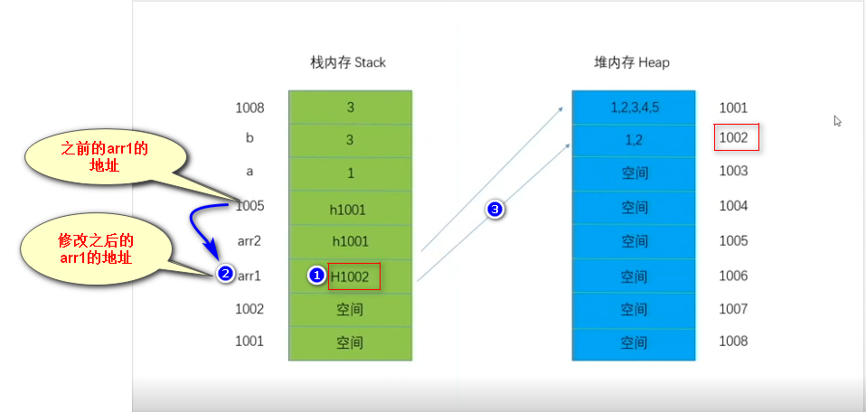

####  src和href的区别?

####  ++a a++以及--a 和a--的区别?
`我的答案:`

可以理解成：

    ++i，增加变量，返回一个新的值
    i++，增加变量，返回旧的值
    --i，减少变量，返回一个新的值
    i--，减少变量，返回旧的值

详情参考[这里](https://www.w3cplus.com/javascript/javascript-increment-and-decrement-operatorssass.html)

####  以下代码执行的结果是什么?

function test(){
  var a = b = 3;
}
console.log(b)    //  test()未执行的问题

#### 函数中的`AO`和`GO`的预编译情况

`我的答案是:`

    function test(a){
      console.log(a)
      var a = 1 ;
      console.log(a)
      function a() {}
      console.log(a)
      var b = function () {}
      console.log(b)
      function d() {}
    }
    test(2)

`分析:` AO:activation object  活跃对象,函数上下文.

    执行步骤如下:

          1、找到形参和变量声明，将变量和形参名作为AO属性名，值为underfined
          2、将实参值赋值给形参,将实参值和形参值统一
          3、找函数申明,在函数体里面找到函数声明，值作为跟AO属性对应的值
          4、给变量赋值,
          5、执行函数

    AO = {
      a:undefined-->
        2-->
        function a() {}-->
        1
      b:undefined-->
        function () {}-->

      d:undefined-->
        function d() {}
    }

`结果是:`

    function a() {}
    1
    1
    function () {}

GO:global object 全局上下文 执行步骤是:

1.找变量----> 2.找函数申明----->3.给变量赋值----->4.执行函数

####  以下代码的执行结果是什么?

(一)

    function test() {
      a = 1 ;
      function a() {}
      var a = 2;
      return a;
    }
    console.log(test())    //  2

    function demo() {
      return a;
      a = 1 ;
      function a() {}
      var a = 2;
    }
    console.log(demo())  // ƒ a() {}

(二)

    a = 1;
    function test(e) {
      function e() {}
      arguments[0] = 2;
      console.log(e)   //  2
      if (a) {
        var b = 3
      }
      var c;
      a = 4;
      var a;
      console.log(b)  // undefined
      f = 5;
      console.log(c)  // undefined
      console.log(a)  // 4
    }
    var a;
    test(1);
    console.log(a) // 1
    console.log(f) // 5
    console.log(d) // Uncaught ReferenceError: d is not defined

AO再被执行的前一刻就会生成,GO在被声明的时候就生成.

####  手写一个闭包

    function test1(){
        function test2(){
          var b = 2
          console.log(a)
        }
        var a = 1;
        return test2;
    }
    var c = 3
    test3 = test1()
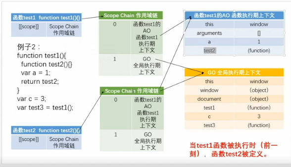

`分析(一):`

 当函数test1声明的时候,就会产生它的全局作用域GO,当test1()执行的时候,就会产生它的执行期上下文AO,
此时test2也在同时声明,这时候,test2的作用域链中就有GO(全局的)和AO(test1函数的).也就是说此时test1的作用域链的指向和test2作用域链的指向相同
,都指向同一个地方;
当test1执行完了return 出test2的时候,也就意味着test1执行完了,按理来说这个时候test1的执行上下文AO就应该销毁了,但是,此时test2还是在test1的AO中(他们都指向同一个AO),
所以AO是不会被销毁,只是指向test1的AO的指针销毁了(看下图所示),没有指向AO了.但是此时test2的指向还是AO.此时就形成了闭包!

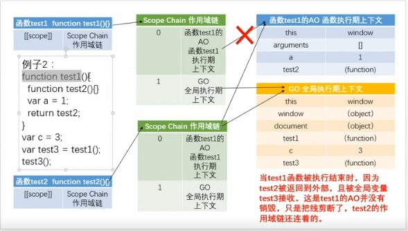

`分析(二):`

执行test3就相当于执行test2,此时,作用域链中test2就产生自己的AO此时test2的AO排第一位(下标为0的),
test1的AO排第二位,全局GO排第三位.(看下图)当执行test2的时候,会先从自己的作用域第一位中找,然后如果找不到
就会从第二位依次找,此时找到了a,输入1.

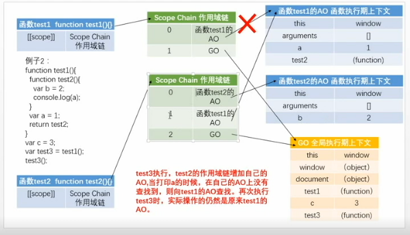

`分析(三):`

当test3执行完成后,也就是test2执行完了,这时候,test2的AO被销毁,但是之前test1的AO被test2牢牢抓住,始终无法释放,这样就容易形成内存泄露.

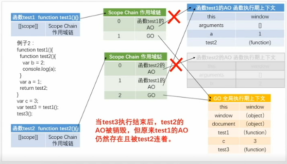

####  如何防止表单重复提交?

####  display:none和visibility: hidden的区别?
####  同步和异步的区别,他们的作用是什么?
####  如何截取一个URL = https://www.baidu.com/index.php?id=1&code=2中的参数?

function splitUrl(url){
  let obj = {}
  url.split('?')[1].split('&').map(it=>{
    obj[it.split('=')[0]] = obj[it.split('=')[1]]
  })
  return obj
}

####  什么是ajax,交互是什么?手写一个ajxa

`我的答案是:`

    function AJAX(method,url,pragram){
      return new Promise((resolve,reject)=>{
        var xhr = new ActiveXObject('Microsoft.XMLHTTP')||new XMLHttpRequest()
        if (method.toUpperCase() === 'POST') {
          this.open(method,url,true)
          this.responseType = 'json'
          this.setRequestHeader('Content-Type','application/x-www-form-urlencode;charset=utf-8')
          this.send(pragram)
        }else{
          this.open(method,url,true)
          this.send()
        }
        xhr.onreadystatechange = function(){
          if (this.readyState === 4) {
            if(this.status === 200||this.status ===304){
              resolve(this.responseText)
            }else{
              reject(this.response)
            }
          }
        }
      })
    }

####  以下代码允许的结果是什么?

let num = (2 + 4, 9 - 1)

`我的答案是:` 8 ,只会打印出最后的一个数;

####  call,apply,bind以及apply()的使用拓展问题

call()和apply()都能改变this的指向并且立即执行,而bind返回一个新的函数,但是不执行,而且当绑定的这个构造函数实例化的时候就失效了.

`当一个构造函数A中的方法和一个构造函数B中的方法想要融合的时候(类似借用属性),可以使用apply(this).`
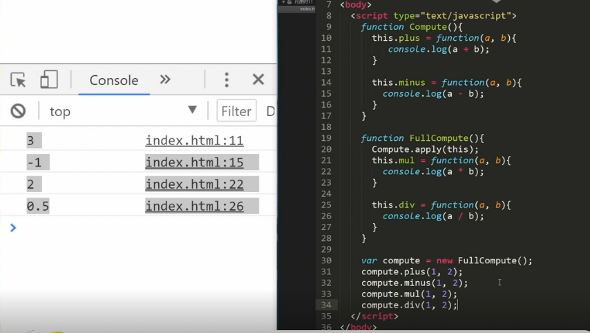

#### 简述一下arguments.callee和caller的用法.

`就是调用自身的函数,当在匿名函数或者立即执行函数中使用非常有效.`

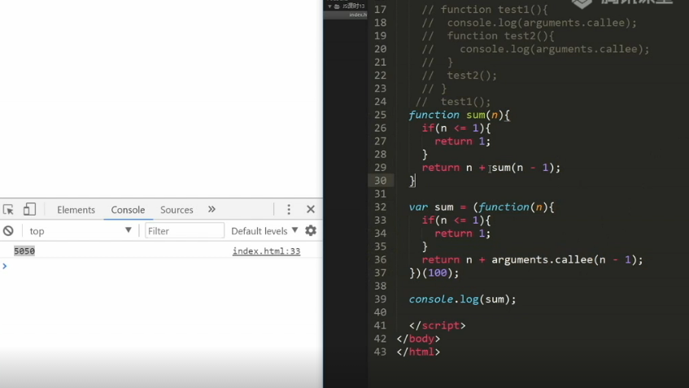

`补充:`caller在当严格模式下会报错.

    test1()
    function test1(){
      test2()
    }
    test2 function(){
      console.log(test2.caller);  // 返回当前被调用函数的函数引用,即检查哪个函数调用了test2.
    }

####  js圣杯模式?
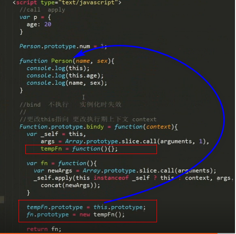

`补充:`
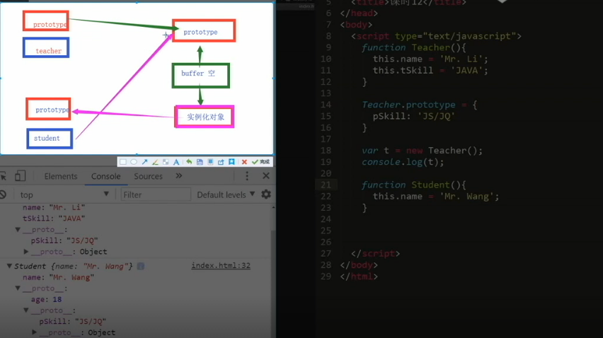

####  对原型的一些补充

Car.prototype.name = 'Benz';
function Car(){}
var car = new Car();
Car.prototype = {
  name:'Mazda'   // 这个是直接重写原型,将破坏原型链.
}

console.log(car.name);  //  Benz
Car.prototype.name = 'Mazda';//如果将Car的原型改成这样 结果为Mazda 这个是修改值

####  什么叫做模块化开发?

`以封装圣杯模式为例:`

    var inher = (function(){
      var Buffer = function(){}
      return function(Target,Origin){
        Buffer.prototype = Origin.prototype;
        Target.prototype = new Buffer();
        Target.prototype.construct = Target;
        Target.prototype.sup_class = Origin;
      }
    })()
以上代码称之为模块化开发,防止代码污染,利与开发!

####  插件的写法

;(function(){
  var Test = function(){}
  Test.prototype = {}
  window.Test = Test
})()

####  三种判断是否为数组的方法
`1:`

var a = [],
    str = Object.prototype.toString.call(a),
    trueTip = '[object Array]',

if(str === trueTip){
  return '是数组'
}else{
  return '不是数组'
}
`2:`a.construct
`3:`a instanceof Array  // 少用

####  什么是类数组?

      var obj = {
        '0': 1,
        '1': 2,
        '2': 3,
        '3': 4,
        '4': 5,
        '5': 6,
        'length': 6
        // 'push': Array.prototype.push
      }
      Object.prototype.push = Array.prototype.push
      Object.prototype.splice = Array.prototype.splice
    原理:
      Array.prototype.push = function (elem) {
        this[this.length] = elem
        this.length++
      }
      obj.push(7)
      console.log(obj)

一道阿里的面试题:

    var obj = {
          '2': 3,
          '3': 4,
          'length': 2,
          'splice': Array.prototype.splice,
          'push': Array.prototype.push
        }
        obj.push(1)
        obj.push(2)
        console.log(obj)

`答案:`

      Object(4) [empty × 2, 1, 2, splice: ƒ, push: ƒ]
      2: 1
      3: 2
      length: 4
      push: ƒ push()
      splice: ƒ splice()
      __proto__: Object

`分析:`

    先要能看懂这个push的原理:
    Array.prototype.push = function (elem) {
      this[this.length] = elem
      this.length++
    }
    当开始的时候,从obj[obj.length]开始push,执行push(2),即obj[2] = 1(那么obj.2 = 1),
    然后length自增加1成为3,执行push(3),即obj[3] = 2(那么obj.3 = 3),然后length自增加1,成为4.
    之前的key为2,3就被替换成为了现在的1,2所对应的值.

    obj[2] = 1
    obj[3] = 2

####  <meta http-equiv="X-UA-Compatible" content="ie=edge">这句话的意思是什么?
`我的答案:`这意味着,系统将强制浏览器按照最高标准去渲染,添加chrome=1,将允许站点在使用了谷歌浏览器内嵌框架(Chrome Frame)的客户端渲染.

####  jQuery如何增加 删除 修改 移动元素或者属性?

`我的答案:`

    $('div').appendChild('span')
    $('div').removeChild('span')
    $('div').setAttribute('title','this is a title')

####  你常用的库有哪些?他们有哪些特点?

`我的答案:` vue和jQuery偏多,vue的优点是,(1)双向数据绑定,(2)vue通过对虚拟dom技术,减少了对dom的操作.
什么是虚拟dom?就是使用js对象模拟dom,在操作过程中,不会操作真实的dom,等待虚拟dom操作完成,
仅仅对比开始状态的虚拟dom和结束状态的dom之间的差距(diff算法),最后根据结束状态的dom去操作dom.

*什么是双向数据绑定?*

####  js的基本类型有哪些?
####  如果你的工程会在不同分辨率上显示,你会怎么处理?
####  原生js实现斐波那契数列。
####  setTimeout 和setInterval 的区别
####  什么是跨域,为什么话发生跨域,如何解决?
####  cookie有哪些优点?
####  用css写出如下的样式?

`答案:`

      

        

          姓名
        

      

    .waper {
        width: 200px;
        height: 200px;
        position: relative;
        background: #ccc;
        overflow: hidden;
    }

    .waper .waper-inner {
        width: 100px;
        height: 100px;
        position: absolute;
        background: yellow;
        top: -50px;
        right: -50px;
        transform: rotate(45deg);
    }

    .waper .waper-inner span {
        position: absolute;
        bottom: 0;
        display: block;
        width: 100px;
        text-align: center;
    }

#### vue中,子组件为什么不能修改父组件传递的props,如果修改了vue是如何监听到属性的修改并发出警告的?

#### vue中 this.$emit()的返回值是什么?

#### vue中 同名插槽是替换还是覆盖呢?

#### Promise相关

`Promise的构造函数中的代码是同步的,但是then中的是异步的.而且状态是不可逆的,如果前面是resolve(res),然后又reject(err),`

      new Promise((resolve,reject)=>{
        resolve('success')
        reject('error')   // 会执行 但是状态不可逆转
      }).then(
        res =>{
          console.log('then===>',res)
        }
      ).catch(err =>{
        console.log(err)
      })

`面试:` 

var a = new Promise( function(resolve,reject){
  setTimeout(function(){
    resolve(b) // b的执行结果是reject,所以哪怕a是resolve,返回的还是b的结果
  },2000)
})      

var b = new Promise( function(resolve,reject){
  setTimeout(function(){
    reject(4)
  },1000)
})

a.then(function(){
  console.log('resovle');
}).catch(function(){
  console.log('reject');
})

####  防抖与节流的作用?

`减少不必要的计算,不浪费资源,只在合适的时间做合适的事情,合适的时间触发计算!`

####  原型高级写法拓展

      function Human(){}
      function Chinese(){}
      Chinese.prototype = Object.setPrototypeOf({
        constructor:Chinese,
        say:function say(){}
      },Human.prototype)

#### http状态码

*1xx* (临时响应)表示临时响应,并需要请求者继续执行操作的状态码.

`代码说明:`

`100` 继续 ,请求者当继续提交请求.服务器返回此状态码表示已经收到请求的一部分,正在等待其余的部分.
`101` 切换协议,请求者已经要求服务器求换协议,服务器已经确认,并且准备切换.

*2xx: * (成功)

`200`  成功=>服务器已经成功处理了请求,通常,这表示服务器提供了请求的网页.
`201`  已创建=>请求成功,并且服务器创建了新的资源.
`202`  已接受=>服务器已经接受请求,但尚未处理.
`203`  非授权信息=>服务器已经成功处理了请求,但是返回的信息可能来自另外一个来源.
`204`  无内容=>服务器成功处理了请求,但是没有返回任何内容.
`205`  重置内容=>服务器成功处理了请求,但是没有返回任何内容.
`206`  部分内容=>服务器成功处理了部分get请求.

*3xx *(重定向)表示要完成请求,需要进一步操作,通常这些状态码用来重定向.

`300`  多种选择=>针对请求, 服务器可执行多种操作,服务器可根据请求者选择一项操作,或提供操作列表供请求这选择.
`301`  永久移动=>请求的网站已经永久移动到新位置,服务器返回此相应(get/head请求的响应)的时候,会自动将请求者转移到新位置.
`302`  临时移动=>服务器目前从不同位置的网页响应请求,但请求者应继续使用原有位置来进行以后的请求.
`303`  查看其他位置=>请求者应当对不同的位置,使用单独的get请求来检索响应时,服务器返回此代码.
`304`  为修改=>自从上次请求后,请求的网址未修改过,服务器返回此响应,不会返回网页的内容.
`305`  使用代理=>请求者只能使用代理访问请求的页面,表示请求者应使用代理.
`307`  临时重定向=>服务器目前从不同位置的网页响应请求,但请求这应当继续使用原有的位置进行以后的请求.

*4xx *(请求错误)这些状态码表示请求可能出错,妨碍了服务器的处理.

`400`  请求错误=>服务器不理解请求的语法.
`401`  未授权=>请求要求身份验证,对于需要登陆的网页,服务器可能返回此响应.
`403`  禁止=>服务器拒绝请求.
`404`  未找到=>服务器未找到请求的页面.
`405`  方法禁用=>禁用请求中指定的方法,
`406`  不接受=>无法使用请求的内容特性,响应请求的网页.
`407`  需要代理授权=>此状态码与401类似,但指定请求者应当授权使用代理.
`408`  请求超时=>服务器等候请求时发生超时.
`409`  冲突=>服务器在完成请求时,发生冲突.服务器必须在响应中,包含有关冲突的信息.
`410`  已删除=>如果请求的资源已经永久删除,服务器就会返回此响应.
`411`  需要有效长度 服务器不接受不含有效内容长度标头字段的请求.

## 算法题目:

####  请写一个冒泡排序
####  选择排序
####  用push手写一个快速排序
`分析:`快速排序的优点就是速度快，为什么速度快呢？我先介绍一下快速排序的原理。
选择一个基准值，一般选择数组的一个值，遍历数组，大的放右边，小的放左边，一样大的放中间，利用递归重复对大的数组和小的数组进行拆分，最后得出排序后的数组。

####  统计一个字符串出现最多的字母

####  list是一个1~100之间的数组,如何让他依次打印出来?如果list是无序的如何让他有序排列?

## 逻辑题

#####  `<壹>` 有2个桶,第一个桶中装的是蓝色油漆,第二个桶装的是红色油漆,假设这两个桶中的油漆,除了颜色不一样,其他的都一样,现在我用勺子,从蓝色桶中舀一勺蓝色油漆,放入装有红色油漆的桶中,然后搅拌,让他们充分混合均匀,然后再用勺子从红色油漆桶中舀一勺混合后的油漆,放入装有蓝色油漆的桶中,最后

`问:`
1. 是蓝色油漆桶中的蓝色油漆多,还是红色油漆桶中的红色油漆多,为什么?
2. 蓝色油漆桶中: blue =  蓝色油漆/红色油漆 , 红色油漆桶中:red = 红色油漆/蓝色油漆,最后blue和red的值相比较,结果是什么?

`分析:`

根据题目中的信息可知:刚开始的时候,两桶油漆除了颜色不同,其他的都一样,可知:

假设初始的时候,蓝色油漆桶和红色油漆桶的中容量都是  `i`

从蓝色油漆桶中舀一勺蓝色油漆,假设这一勺蓝色油漆的容量为x,放入红色油漆桶中,混合均匀后:

此时,蓝色油漆桶中的蓝色油漆为: `i-x`

红色油漆桶中的油漆是红蓝混合的: `i + x`

此时:又从红色油漆桶(这时候里面的油漆是红蓝混合的)中舀一勺油漆,容量也是`i`,放入蓝色油漆桶中,混合后:

此时: 蓝色油漆桶中的油漆(也是红蓝混合的)为:`(i-x) + x`

红色油漆桶中的油漆(也是红蓝混合的)为: `i+x - x`

##  其他
