# 股市到底有多赚钱？

### ❓ 为什么有人在股市亏钱？

 - A 追涨杀跌
 - B 盲目跟风
 - C 股票的价格不是直线向上的，而是不断波动的

### ✍️  公司的三种价值！

- A 公司的股票价格：市场价值，也叫做市值，表现形式为公司的股票价格。市值=每股股价x总股数。
- B 公司的资产价格：账面价值，也叫做公司的资产价格，指的是这家公司有多少资产，也就是这家公司有多少钱。
- C 公司未来的经营价值：内在价值，也叫做公司未来的经营价值，是综合这家公司的经营情况，盈利前景，和其他影响公司经营因素之后，得到的真正代表这家公司的价值。

### ❓怎样通过判断公司的价值赚钱。

- A 在市场价值低于内在价值的时候买入。
- B 寻找内在价值长期上涨的股票。
- C 预测市场价值的变化，在低点买入，高点卖出。

`分析：`

	A选项，"在市场价值低于内在价值的时候买入",这一个方法，也叫做“捡烟蒂”投资法；✅
	B选项，“寻找内在价值长期上涨的股票”,也叫做“好公司”投资法；✅
	C选项是技术派的投资方式，在真实的市场中，股价的变化受情绪，政策，经济大环境等其他因素的影响，想要单纯的靠预测市场价值的变化来低买高卖，并没有那么容易；❌

### 公司的这些行为会影响我的钱包。

#### 1⃣️   分红	

#### ❓ 分红都有哪些形式？

- A 现金：现金利股，一般以每10 有股派发多少钱的形式进行。
- B 股票：股票股利，分为2种，一种是送红股，简称`送股`，另一种是“转赠股本”,简称`转股`，都是将利润以股票的形式送给你，两者的纳税有区别，比如：10股送10股，10股转10股，对于投资这来说，手中股票变多了。多出的股票会在股权登记日出现在你的账户上。

#### ❓ 为什么不能在股权等级日买入，第二天卖出？

`答案：` 因为第二天股价会除权除息，这种行为并不能赚到钱！

📖 **除权除息**

	⚠️注意：为了防止空手套白狼的行为扰乱市场秩序，股市的交易规则规定：公司分红过后，股权登记日的第二个工作日，股价会被除权除息处理，所以，股价必然下跌。

**除息**：现金股利分红后，股价会被扣除每股所分摊到的现金红利，这叫做除息，简写为XD。例如：某股票股价10元，在进行每10股分红5元的股利分红后，股价下跌至9.5元！

**除权**：股权股利分红后，公司的市值不变，股票的数量增多了，股价就会降低，这叫做除权，简写为XR。例如：某公司市值10亿，股票数量是1亿股，股价是10元，假如进行股权股利分红（每10股送10股），除权之后，股价就降低至每股5元！

假如公司如果同时进行了现金股利和股权股利分红后，就要同时进行除权除息，简写DR。

### 2⃣️ 公司发行新的股票

#### ❓  发行新的股票和转股送股有什么区别呢？

1. 从公司的角度来看，发行新股的目的是为了融资，会增加公司总体的资产，而送股和转股是在进行利润分配，公司整体资产不会增加。

2. 从投资的角度来看，发行新股后，你想获得更多的股票，你需要花钱买，但是送股和转股是在白送你股票。

🔰 发行新股有2种方式，一种是**增发**，另一种是**配股**!

1. **增发**又分为**公开增发**和**定向增发**，公开增发：面向所有股民再次发行股票，发行的价格不低于前期均价；定向增发：只面向特定的大佬发行股票，普通投资者是无法申购的，定向增发的发行价格不低于前期均价的90%。

2. **配股**只是面向原来股票股东发行股票，形式和分红类似，也是，“每10股配售多少股”。配股的发行价格没有限制，但是为了吸引投资者，公司在配股时 定的发行价格会比前期均价低很多。

   

⚠️  **注意：**增发不需要除权，但是配股需要。配股之后的股价=（股权登记日的股价+配股价x每股配股数目）/ (1+每股配股数)

假如:某公司进行配股，配股比例是每10股配2股，配股价格为7元，股权等级日当天价格是10元，除权之后：(10+7*0.2)/(1+0.2) = 9.5 元，股价变成了9.5元！假如你认购了，平均下来，每一只股票的价格是9.5元，假如你放弃认购，你的股票价格是不是从10元，跌到了9.5元。

#### ❓  我们经常听到的A股到底是什么？

**A股**的全称是`人民币普通股票`，它最初的购买对象只限境内居民购买，用的都是人民币，公司在A股上市，主要是募集境内资金，A股名字一半不带A除非他也同时发行了B股，作为区分，才会加A，比如：张裕A

**B股**的全称是`人民币特种股票`，一开始只限用外汇（港币和美元）购买，主要是为了募集境外资金！

股市**依据准入政策**分为**五**个板块分别是：**主板**，**中小板**，**创业板**，**科创板**，**新三板**，对于股票新手来说，开通股票账户之后，能直接交易的板块只有2个，那就是**主板**和**中小板**！

📌  **主板：**

`主板的上市企业多半是大型成熟企业，资本规模大，基础好，盈利稳定，主板能在一定程度上体现全国的经济发展状态，素有，“国明经济晴雨表”之称，上交所和深交所都设有主板，上交所的股票代码都以‘60’开头，深交所的股票代码都以‘000’或者‘001’开头。`

📌 **中小板：**

`中小板是相对主板而言的，主要是中小型发展稳定的企业，公司规模不够大，达不到主板上市的要求，只能在中小板上市，而且中小板只设置在深交所，股票代码以‘002’，‘003’，‘004’开头`

**创业板**和**科创板**大多数都是高科技业务，具有较高的成长性，但是一般是成立时间短，规模小，当前业绩可能不出众，却具有很大的成长空间！

📌 **创业板：**只设立于深交所，股票代码以`300`开头,对于公司来说，实行的是**审批制**，符合条件的公司，需要审批通过才能上市，条件较为严格。

📌 **科创板：**科创板只设立于上交所，股票代码以`688`开头，对于公司来说，他实行的是**注册制**，符合条件的公司，注册之后就能直接上市了，无须审批，条件较为宽松。

📌**新三板：**全称“全国中小企业股份转让系统”，是完全独立于，深交所和上交所之外的证券交易场所。新三板集中的就是无法在另外四个板块上市的中心微企业，这些企业实力还不太强，但是，收入和利润也达到了一定的规模，所以，先在新三板挂牌，大多数是希望公司未来发展状大之后，在转移到其他板块上市，新三板也有自己的股票代码，以`400`，`420`，`430`，`830`开头。

🔑 创业板权限：首先要有2年投资经验，其次是开通钱20个交易日，账户有不低于10万人民币。

🔑 科创板权限：首先要有2年投资经验，其次，开户时，账户上要有50万人民币以上。

🔑 新三板权限：不仅要有2年经验，开户时，账户上更是要有100万元以上的资金。

### 什么是大盘？

上证指数（大盘）：指上交所中所有股票的加权平均值，加权可以理解为不通股票在上交所的占比是不一样的。

深证成指（中小盘）：在深交所中，按照一定标准选出500支股票，并对其股价进行加权平均后的结果，能直接反映出深交所的整体股价波动情况。

创业板指（小盘）：创业板市场中所有股价的加权平均值，直接反映的是创业板市场的整体股价波动情况。

A股的交易时间是：9:30～11:30，13:00～15:00

开盘价和收盘价：

**开盘价：**股市在9:15～9:25这10分钟内，系统有另外一套撮合成交的机制，不是立即成交，而是统一在一分钟内成交，最后撮合成功的价格，被定位开盘价！

**收盘价**：收盘的最后三分钟内，系统会将撮合成交的方式更改为 统一在最后一分钟内成交，最后撮合成功的价格被认定为收盘价。

**A股独有的特色--涨跌停制度。**

这个制度起源于1996年12月16日，当时的管理层发现，股票短时间内涨的太高或者跌的太狠，对市场是不利的，因此，为了避免市场过于波动，让大家能安心炒股，管理层决定，对所有的上市股票定制一个涨跌幅限制，这就是涨跌停制度。

股票的上涨幅度和下跌幅度只能是**上一个交易日收盘价格的10%**！假如一家公司的上一个交易日股价是10元，最多上涨到11元，最多下跌到9元！

😎 涨跌幅限制还有一些例外的情况：比如股票名称前带有`ST`，`*ST`，`SST`，`S*ST`，`NST`标识的，一定要注意提高警惕，他们的单日涨跌幅不超过5%，新股上市第一天，股价涨幅不受10%的限制，但是最高涨幅不能超过发行价的44%。

`ST：`特别处理，这个是证券交易所对连续**2年**都亏损的上市公司进行的特别处理。

`*ST：`证券交易所对连续**3年**都亏损的上市公司进行的特别处理。

`S*ST:`证券交易所对连续**3年**都亏损的上市公司,发出推出股票市场的警告。

`NST：`意思是，这家公司之前**ST**过，现在经过特殊处理后，重新进入股票市场。

市盈率（PE）= 市值 / 净利润 （即：PE = 买下公司需要的钱 / 每年能赚到的钱），一家公司的PE越小，说明回本时间越短，越具有投资价值！

市净率（PB）= 市值 / 净资产  一家公司的PB越小，代表这家公司的价格越低，越具有投资价值！

### 如何找到合适的入场时机❓

当沪深300，中证500中任意一个的PE和PB同时满足：

1. PE的当前分位点处于近10年数值的0～50%区间内；
2. PB的当前分位点处于近10年数值的0～20%区间内；

就可以入场了！

2015年5月是好的入场时机吗？

红框中的参数：

1. PE-TTM：就是PE，TTM可以认为是一种更为精确的计算PE的方式，
2. 加权平均值：表示把所有沪深300包含的公司市值相加，除以300家公司的净利润之和，相当于把这300家公司“合并”成一家“大公司”，来计算他的PE。
3. 当前分位点：就是将沪深300前十年时间内的所有PE收集起来，按照从小到大的顺序排列，然后用当前PE来比较一下，就知道当前PE是大还是小了。从而就得到了当前分位点了。如果当前分位点是100%，那么当前PE是出于最大值，如果是50%，那么说明当前PE是出于中等位置。

# 建立你的投资组合，合理规避风险。

### ❓ 投资股票有哪些风险？

`一种是非系统性风险，另一种是系统性风险！`

📌 **系统性风险**：

整个股票市场存在的下跌的风险:

	1.  政策改变，导致企业生存条件发生变化;

   	2.  购买力风险，通货膨胀风险；
            	3.  利率风险，市场利率不断波动！

📌 **非系统性风险**：

单只股票本身的风险:

		1.  经营风险 ，公司经营的错误决定，很可能导致公司业绩大幅度下滑;
	
	 		2.  公司违背信用而产生的风险;
	            		3.  道德风险，违背道德事件，比如：三鹿奶粉事件！ 

###  ❓ 非系统性风险如何避免？

`答案：` 构建投资组合，把资金分散在多个行业的多只股票上。不要把🥚鸡蛋放在一个篮子🧺里面

### ❓ 组合里面，有多少股票合适？

`答案：`一般来说，持有4～8只股票是比较经济有效的做法！

#### ❓ 什么叫做“分散在多个行业”呢？

`答案：` 同行业投资资金额不超过30%！

# 如何寻找高投资回报率的股票

🐎 有一种股票，自带咖位，在股价的走势方面也是台布稳定他们有三个特点：`投资回报率高`，`长期业绩优秀`，`信息相对可靠`。

💡 投资收益率的计算：一只股票的投资回报率，又叫做`投资收益率`

✍️ 例如：**在2016年6月27日，以18元的价格买入格力电器，到2018年1月26日，以57元的价格卖出！投资收益率是 (57/18-1) x 100% = 217%**

如果计算到每年的话，就是：

​			**年化复合收益率** = 【（卖出价格/买入价格）^(1/n) -1】* 100%      即：卖出价格除买入价格得到结果，然后用结果的n（投资n年）分之一次方➖1，最后乘以100%。

从长期看来，一只股票的回报率与企业的发展息息相关，如果一家企业40年来的盈利一直是资本的6%（即ROE6%），那40年后你的年化收益率不会和6%有什么区别，即使你当时买的是PE较低的便宜货，如果企业在20到30年内盈利都是资本的18%，即使买的股票不太便宜，其回报率也会令人满意！  ---- 查理 · 芒格

### ❓ROE （净资产收益率）是什么？

`答案:`  净资产收益率 = 净利润 / 净资产

**总结**：`ROE越高，股票的年华收益率就越高`

😎 初筛白马股！

1. 寻找白马股的第一个筛选条件就是，**ROE连续7年>=15%**,推荐一个筛选白马股的[神器](https:www.iwencai.com),

   🌟 例如:以2018年6月1日为时间点筛选白马股，操作就是在i问财搜索框 输入： `2011年到2017年ROE>=15%,2018年3月31日ROE>=3.75%,上市时间早于2013年6月`。得出筛选出的`37`之股票！

那么判断公司赚钱是否够持久，是否够多，看**ROE是否连续7年大于等于15%**，并且**上市时间要大于5年**！

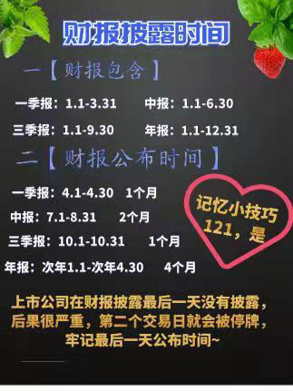

⚠️ ：如果我们是**最新一天（比如：今天）**去筛选白马股，可以直接写上市时间大于5年，这个不用算，最简单粗暴，以后大家肯定都是最新时间去筛选，所以直接用这个就好！

💥 还有个方法，就是**上市时间早于**来表示，比如现在是2020.06.03 我们需要上市时间大于5年，2020年往前倒推一下，年份减去5年，日期不用写，就可以写成：`上市时间早于2015年6月`

**回溯历史时间：用上市时间早于具体的年月份！**

🔑  作业: 2020.4.30的筛选条件：

**答案：** 2013年到2019年ROE>=15%，2020年3月ROE>=3.74%，上市时间早于2015年3月

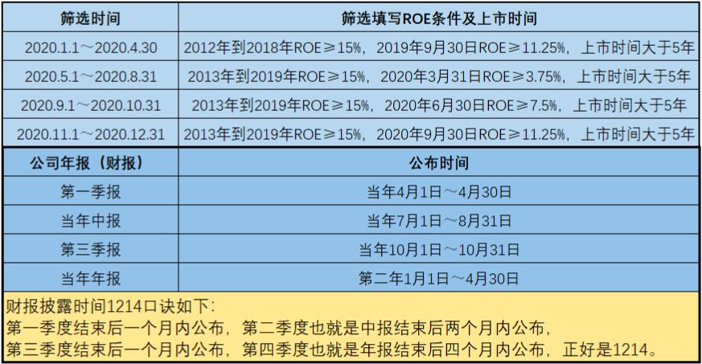

# 📖“好公司”投资法，剔除周期股

### ❓什么是经济周期呢？

`答案：`国名经济呈现扩展与紧缩交替的波动变化！

周期性现象具有以下两个属性： 

1. 必然产生，地球会一直围绕太阳转；
2. 循环往复，夏天过去秋天，冬天过去，春天还会远吗？

### ❓是不是所有企业都是周期股票 ？

`答案：`不是，受到影响会不一样，影响很明显的才是周期股！

公司所处的行业不同，受经济周期影响的程度也不同！比如：汽车行业，受经济周期影响，属于周期性行业！

### ❓如何剔除周期股？

 `答案：`通过判断所处行业，判断是否是周期性行业，就能知道这个股票是不是周期性股票！

**四类要避开的行业：**

1. 作为工业基础原材料的大宗商品相关行业，比如：采掘服务，钢铁，化工合成材料，石油矿业开采，有色金属冶炼，化学制品等！
2. 航运业，比如：海洋运输，港口航运，机场航运，交通设备服务等！
3. 非 生活必须品行业及与之相关的行业，比如：国防军工，汽车整车，汽车零部件，建筑材料，房地产等！
4. 非银行的金融行业，比如：证券，保险及其他！

✍️ 实操：在爱问财网站输入：` 2011年到2017年ROE>=15%,2018年3月31日ROE>=3.75%,上市时间早于2013年6月，行业`点击搜索！选出如下**37**只股票：

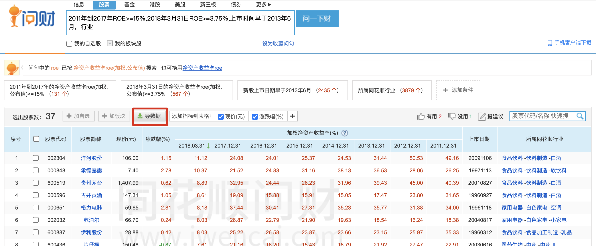

通过筛选掉周期性股（黄色背景图片），得到如下：

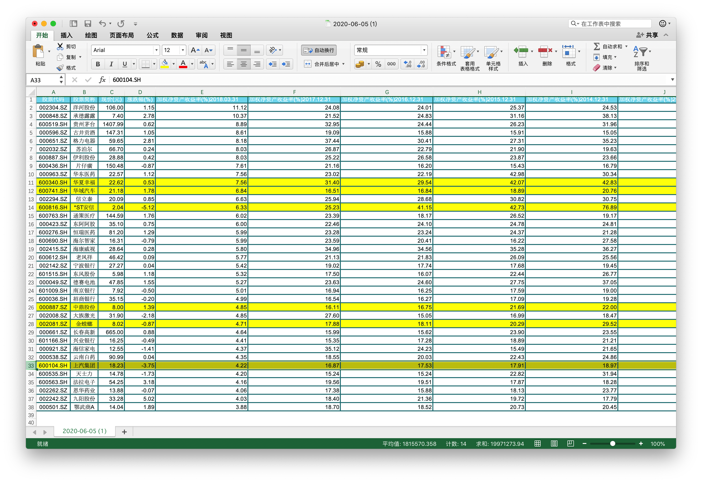

# “好公司”投资法，剔除基本面转坏的股票！

### ❓ 如何判断一家公司业绩是否有下滑的迹象？

`答案：` 要想知道白马股的业绩是否有下滑的迹象，只要比较公司当前和过去的**营业收入增长率**及**净利润**就可以！

### ❓ 如何计算营收增长率？

⚠️  上市公司除了有**年报**，还有**季报**，为了能及时了解公司的业绩的变化，还可以比较本季度与去年同季度的业绩。

✨  年度营收增长率  = （本年的营业收入- 去年的营业收入）/ 去年的营业收入

✨  年度净利润增长率  = （本年的净利润-去年的净利润）/ 去年的净利润

✨  季度营收增长率  = （本季度的营业收入- 去年同季度的营业收入）/ 去年同季度的营业收入

✨  季度净利润增长率  = （本季度的净利润-去年同季度的净利润）/ 去年同季度的净利润

👉  评估白马股业绩是否有下滑，我们需要看**四个**指标：

1. 最近的年度营收增长率
2. 最近的年度净利润增长率
3. 最近的季度营收增长率
4. 最近的季度净利润增长率

✅  如果以上这四个指标🀄️只要有一个是**负数**，就要从组合中剔除！

🔥 实操：剔除基本面转坏的公司！

在i问财输入搜索条件，`2011年到2017年ROE>=15%，2018年3月31日ROE>=3.75%，上市时间早于2013年6月，行业，2018年3月31日营收增长率，2018年净利润增长率，2017年营收增长率，2017年净利润增长率`

结果如下：

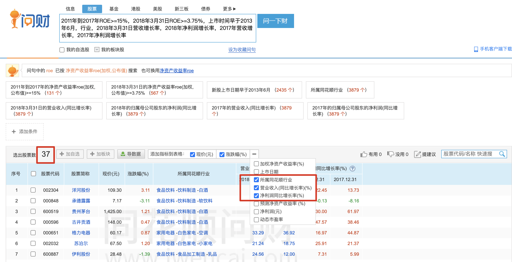

导出Excel结果（红色的是不符合的）：

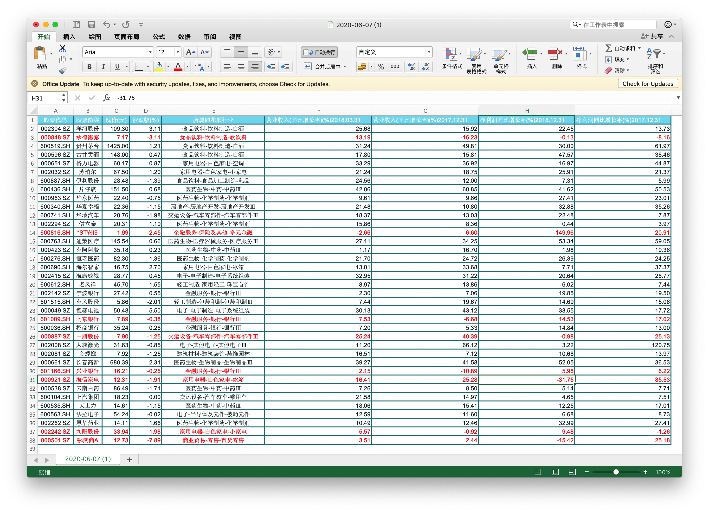

#  财务三表分析，如何识别收入美化？

### ❓ 财报是什么？

`答案:`	从会计角度，记录公司所有经营事务的报表！**季度报表**，**半年报表**，**年度报表**！

📈  财报分为**三个**：

1. 利润表，又叫做损益表，主要是体现一家公司在一段时间内是亏钱还是赚钱。
2. 资产负债表，记录特定的某一天，公司有多少钱，财，物以及欠别人多少钱！
3. 现金流量表，开支流水账，记录了公司花出去多少钱，收入了多少钱！

⏰ **营业利润 = 营业收入 - 营业成本 - 三费**  

⏰ **净利润 = 营业利润 - 所得税**

⏰ **三费 = 管理费用+ 销售费用 + 财务费用**

### ❓什么是公司的收入？

`答案：`公司一旦给了货，无论是否收到了钱，都可以确认为营业收入！

### ❓ 收入美化怎么识别？

`答案：`综合分析财务报表中，营业收入和应收账款的变化。

应收账款：企业卖产品给客户，但还未收到的钱，也就是客户签的白条！

营业收入：企业卖产品获得的收入，即使没有收到现金，收到的“白条”也是计入收入的。

⚠️  **定理一：**`连续2年应收账款上升幅度大于营业收入上升幅度，这家公司就需要注意！`

----------

✍️  实操：以**人民同泰为例**

第一步：打开[理杏仁](https://www.lixinger.com/analytics/company/dashboard/mutual-market/ha)网站，在右上方搜索框输入，“人民同泰”，回车搜素之后，点击`利润表`，得到如下的结果：

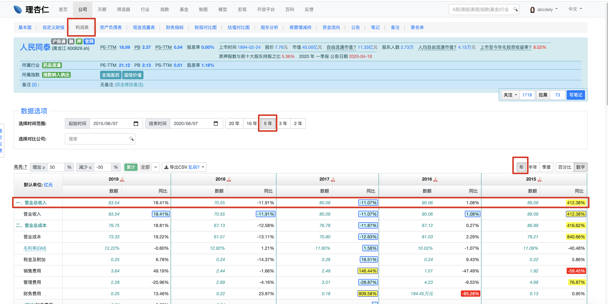

将近5年的营业收入数据，复制进一个Excel表格整理。

第二步：点击`资产负债表`，得到结果如下！

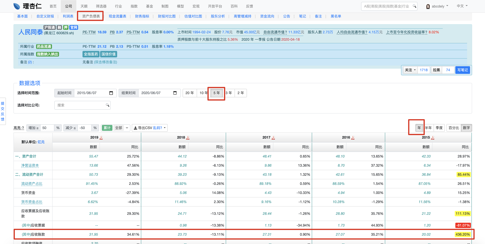

同样，将图中的数据复制进Excel中：

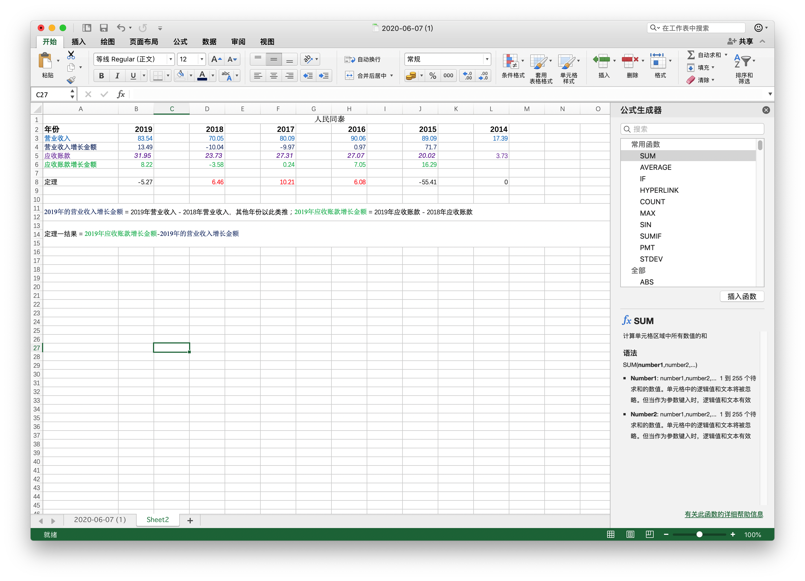

**从Excel中可以看出，在2016～2018年连续3年，应收账款涨幅都大于0，所以不符合要求！**

`总结定理一:`

①如果出现连续两年应收账款增长金额-（减去）营收增长金额>0，说明这个公司连续2年应收账款上升幅度大于营收上升幅度，小心了！套路啊！！
②如果应收账款增长金额-（减去）营收增长金额一年大于0、一年小于0，或者连续2年小于0，无须担心。

# 如何识别资产美化？

👉  资产属于**资产负债表**

1. 资产：分为货币资金，应收账款，存货，预付款项，固定资产等！
2. 负债：应付账款，短期借款，长期借款，还有所有者权益（比如：资本公积金，未分配利润）

资产 =  负债 + 所有者权益

### ❓怎么才能避开资产美化的公司呢？

`答案：`

1. 看存货是不是一直在涨；
2. 看营收有没有增长

`总结定理二：`连续2年，存货增长大于营业收入的增长，这家公司的存货可能存在问题！

`验证：`

第一步：在理杏仁中搜索`獐子岛`，在**利润表中**找到2011年～2014年的营业收入数据，并计算出营业收入的增长情况，将结果复制进Excel表格；

第二步：点击资**产负债表**，找到**存货**这行数据，同理，复制到Excel表格中！

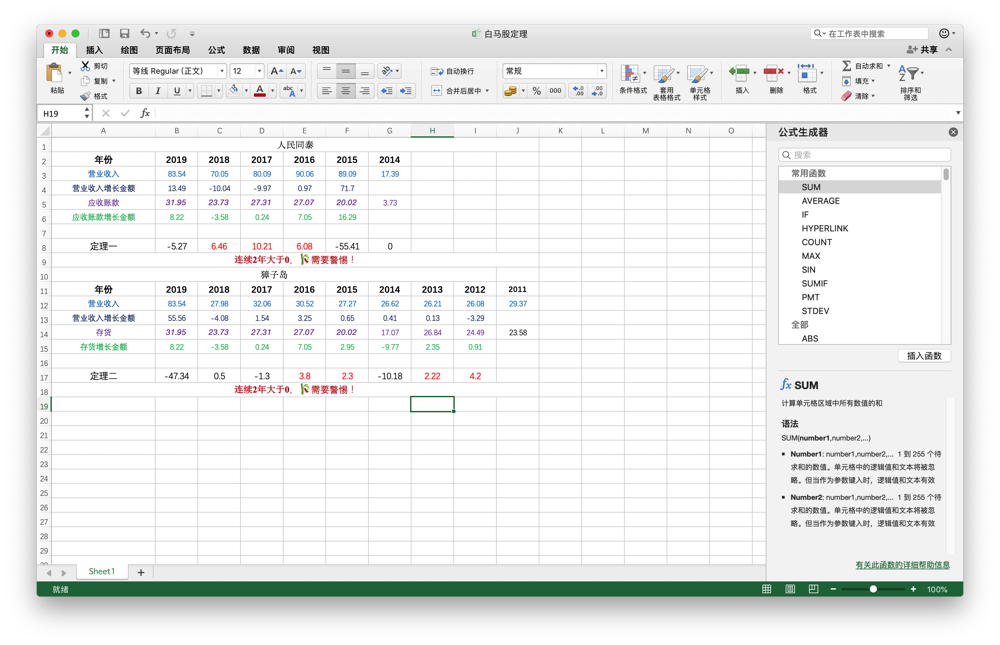

`定理二:`**如果结果大于0，说明 存货涨幅更大，相反，说明营业收入涨幅更大！如果连续2年都是大于0，说明这家公司连续2年存货涨幅都是大于0的，需要当心了！**

 `定理三：`**如果一家公司的流动负债远大于流动资金的话，说明这家公司已经非常接近破产了！**

1. 流动资产：一年内可以变现的资产，比如：货币资金，存货，预付款
2. 流动负债：一年内必须要还的钱，比如：应付账款，短期借款等
3. 流动比率：流动资产/流动负债
4. 如果企业的**流动比率<1**，说明流动资产小于流动负债，危险的信号！

🎉  在**资产负债表**中，最下面有个`流动比率`,如果有2年流动比率<1 ,需要注意！只要其中一个定理不符合，就要剔除！

# 现金流量表

⚠️ 经营活动产生的现金流净额 不等于 净利润，如果公司收到钱，但是没有给出货，利润表中净利润没有变化，说明公司对上下游的合作公司有较强的话语权，是一种隐藏的盈利能力。（经营活动产生的现金流净额中，除了净利润，还有其他的现金流入流出）如果这部分数字足够大，公司赚的现金比净利润的数字多得多，这便是公司隐藏的盈利能力！

`定理四:`当一家公司的经营活动现金流净额远大于净利润的话，什么这家公司具有隐藏的盈利能力，可能是一座金矿！

比如：收到钱，但是，没有给出货，那么经营活动现金流量就会增加！

**自由现金流：**公司能真正自由运用的资金！

`定理五：`自由现金流是衡量公司现金流量情况的指标，代表着公司能真正自由运用的资金，比净利润更真实，更难做假！

tips：

1. 自由现金流 = 经营活动产生的现金流量净额 - 资本开发
2. 资本开支是现金流量表中的“构建固定资产”，无形资产和其他长期资产支付的现金！

在理杏仁网站，搜索出`伊利股份`点击页面的**财务指标**模块，找到最下面的 **六、现金流量**，中的自由现金流量，查看数据！

公司现金流量表记录的是一段时期内，公司现金流入流出的情况。
`定理四：`通过经营活动产生的现金流量净额和净利润的差额大小，帮助我们判断挑选出来的公司是否可能有隐藏的盈利能力。
`定理五：`通过现金流这个指标帮助我们检测公司是否能真的健康发展，比净利润更佳真实，更难做假。

# 构建你的白马组合！

⚠️：  好公司不等于“包你赚大钱”好公司也得有好价格。

即使是好公司，如果在价格很贵的时候入场，你将承受长期下跌的煎熬，很可能中间熬不过离场，最终只能悔恨。股票的贵与便宜是相当公司的价值而言的，而不是只看价格。

####  PE和PB估值：体现价值和价格的关系的就是估值，想要避免在价格贵时买入股票 就要用的估值指标--PE和PB。

第一步：打开理杏仁网站，搜索**格力电器**，在基本面=>价值分析栏目下可看出PE-TTM（扣非）的数据，拉到下面，可以看到PB（ 不含商誉）的数据。

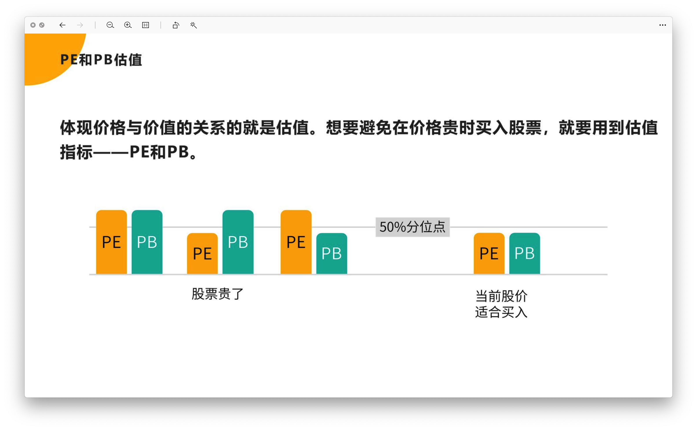

### 股票太多或者钱不够怎么办？

`答案：`

1. 根据PE 分位点大小排序，优先选择PE分位点低的股票；
2. 找出他们当时的价格，并计算出购买一手（100股）的价格，根据自己的资金量，选择股票数量，同一行业的股票数量不超过30%，行业看二级行业即可！
3. 投资组合股票建议是4-8只，如果手上资金够多，可以是8只，这样同行业的股票数量不能超过2只。

### 资金该如何分配？

平均分配到每只股票，以选出的8只股票为例，用总资金量 / 股票数量（8） ，计算出每只股票需要投入的金额，再次用每只股票的投入金额 / 一手需要的价格 ，就得出购买数量。

### 组合切换

当股票变坏的时候，就要卖出：

1. 当股票的价格高于他的价值了；
2. 原来的好公司，基本面转坏了；
3. 发现了更好，更便宜的股票；

### 长期持有

每年定期塞选一遍，新旧组合中，保留重合的组合，卖掉新组合中没有的，买入新组合中有的，只要是买入的价格是低于公司价值的好股票，长期持有就会有收益。

# 便宜组合

### ❓怎么知道现在的价格是高还是低呢？

`答案：`用估值指标：

1. 市**盈**率PE：PE = 公司市值 / 净**利润**，从公司年赚多少钱来衡量公司价值；
2. 市**净**率PB：PB = 公司市值/ 净**资产** ，从公司的资产能卖多少钱的角度来衡量公司的价值；

**双低指数中的双低，指的是市盈率PE和市盈率PE**

还有一个估值指标👉：可以看公司是否能大方的分钱。

### ✅ 便宜组合的标准：

1. 0<PE<10
2. 0<PB<1.5 
3. 股息率>3%

股息率 = 公司过去一年的累计现金分红 / 公司市值

### 实操筛选便宜组合

第一步：进入理杏仁，点击“筛选器” ➡️ “基本面筛选”，市场，选择A股市场，交易所，选择沪深两市，看图👇

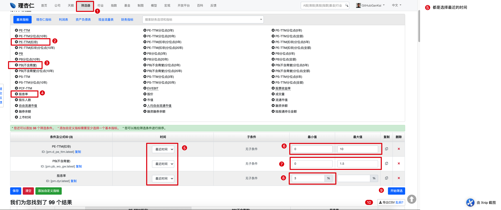

便宜组合的三个指标：

1. 市盈率选择PE-TTM（扣非）。扣非：意思是扣除非经常性损益，非经常性损益：在利润表中属于利润的一部分，和公司正经经营的业务无关（比如说：卖掉公司的办公大楼，或者公司用车获得的收入等）。有些公司，扣非净利润和非扣非净利润相差很大。
2. 不含商誉的PB。商誉：公司收购其他公司时，超过该公司净资产的部分，是公司资产的一部分，商誉本质上并不是真正的资产，所以计算PB的时候，要把他去除。
3. 股息率。

补充解释一下商誉：比如说你和老王都开了一家超市，他家超市开在你对面，你想把他收购了，其实你暗地里计算了，他那家超市净资产只值10万，但是老王不傻，你既然想收购我，开口就要20万，少一分钱都不行，那么，如果收购了老王的超市，在公司财务帐上，你多付的那10万，就叫做商誉。如果净资产中商誉太多，会造成公司被低估的现象！

详情可以查看这个视频[链接](https://share.weiyun.com/JkqXmsQo)

# 如何筛选便宜组合

### 假设用 8～10只股票，构建便宜组合筛选技巧：

1. 同一行业公司不要超过30%
2. 用PB分位点进一步筛选低估股票
3. 大部分是周期股，如果PB分位点<20%,就符合。超过久剔除。

### 资金分配（以1万元为例）

资金均配：确定价格最高的股票买入一手的金额，其余股票的金额往这个金额上靠就可以了。

### 便宜组合的切换

每隔半年调仓：

1. 每隔半年，重新筛选一次便宜组合；
2. 将最新组合和原来的对比；
3. 新旧组合中重合的保留；
4. 卖掉旧组合中含有的，但是新组合中没有的股票
5. 补充新组合中没有，但是新组合中没有的股票。

便宜组合投资的关键------>被动投资，**心态很重要！**

市场整体估值：筛选出的便宜组合越多，意味着当前股市整体估值越低。筛选出的股票越少，说明股市整体估值越高。

# 股市交易时间

`A股的交易时间是周一到周五上午9:00～11:30，下午1:00～3:00`

股票买卖以“手”为单位：**1手 = 100股**，少于100股的1 ～ 99 股被称为零股，A股最低的买卖单位手1手，也就是100股，无论你买多少，都必须是100的整数倍，所以，如果一只股票的价格是26.2元，最少购买100股，那就是 100 * 26.2  = 2620 元！在加上，还有一些**印花税**，**过户费**以及**佣金**。

`印花税：`他以每笔交易额等**千分之一**收取，只在股票**卖出时候收取**，买入不收，被国家税务局收取。

`过户费：`以每笔交易成交额的**千分之0.02**向买卖双方收取，**买入卖出都要收取**，被中国证券登记结算公司收取。

`佣金：`他以每笔交易成交额的定额比例收取，目前市场上证券公司的佣金比例是每笔交易金额的**万分之三**，最高不超过千分之三，一次佣金不足五元的按照**五元**收取。**佣金属于双向收费**，买卖双方都要收取，被证券公司和交易所收取。

### 我该用哪种方式买股票？

1. 限价委托：是用户先限定一个买入或卖出价格。当买入股票时，交易系统会以用户设定的价格买入股票，而在卖出股票时，交易系统会以用户设定的价格卖出股票。当你设定一个价格的时候，只要股价到了这个位置，交易系统就会自动以这个价格买入，或者卖出。限价委托的“价格”可控，但是交易时间“不可控”（设置之后：当天有效）。
2. 市价委托：是一种指定交易数量，但是不给出具体价格的委托方式。市价委托价格“不可控”，但是交易时间“可控”。当你非常看重某个股票，不管股票多少，一定要买，就可以用这个方式。

A股交易采用的是“T+1”交易制度，这里的T代表trade，表示交易当天，而“T+1”表示交易日之后的第二个交易日。“T+1”表示投资者当天买入的证券不能在当天卖出，需要等到第二个交易日才能卖出。

# “天时”说得就是一定要选择正确的入场时机。

### ❓怎么判断股市的入场时机？

打开理杏仁网站，找到“沪深300”和“中证500”这两只指数的PE-TTM（0～50%）和PB（0～20%）分位点！

# 周期之王-券商股票买卖技巧

### 券商为什么能赚钱？

`主要和主营业务有关：`

1. 经纪业务：股票交易，赚取佣金业务；
2. 投资业务：券商自己也买股票，大赚一笔；
3. 投行业务：IPO（首次公开幕股），定向增发，并购重组等相关业务；
4. 资管业务：银行理财，信托等；

`券商的优缺点：`

1. 简单粗暴：不需要分析太多的财报
2. 收益不菲：牛市暴涨
3. 要有足够的耐心（缺点）

### 券商的估值指标

`估值指标：`

PE = 市值 / 净利润

PB = 市值 / 净资产

股息率 = 公司过去一年的累计现金分红 / 公司市值

### 券商的筛选方法

**如何买入**❓ 

**2**个硬性指标：

1. PB分位点 `小于`10%
2. 牛市高点结束了`2`年以上

**3**个加分指标：

1. PE分位点 `小于`20%
2. 股息率`大于`2%
3. 优选营收规模大的龙头企业

为什么PB要在10%，硬性指标只看PB不看PE啊❓为什么牛市结束时间要在2年以上呢❓

`PB`指公司资产，如果PB高，市场价值被高估了，PE是公司的盈利能力。

## 买入

**实操筛选：**以2014年5月4号为例！

第一步：在理杏仁搜索**华泰证券**，在搜索出的结果面板中找到“所属行业”，点击`证券`，进入所有证券页面看板。

第二步：点击页面中的`数据显示设置`

将出现一个弹窗，先依次选中**PB**（不含商誉）**分位点**（10年），PE-TTM（扣非）分位点（10年），股息率。👇

然后点击`利润表`,选中，**营业收入**这项：👇

选择财报📅日期为**2013-Q4**，然后点击导出CSV，如下！👇

然后按照2个硬性指标，3个加分指标来进行塞选！

1⃣️PB分位点小于10%，2⃣️牛市高点结束了`2`年以上！其他的**3**个加分的条件可以根据自己的看重点进行筛选！

将`PB，PE，股息率`，这三项的单元格格式设置为百分比！筛选PB小于10%的，PE分位点小于20%的！

### 何时卖出❓

1. 贪心赚取高收益且不着急：当PB分位点高达80%～90%卖出；

2. 想保持一定收益又稍微有点耐心，PB分位点在50%左右卖出；

3. 落袋为安类型的，在PB分位点在20%左右卖出；

以`益丰药房`为例：

## 百业之母--银行股筛选

#### 银行赚钱的逻辑

1. 吸收存款，活期存款年利率在0.3%～0.35%之间！定期存款年利率在2.75%～4%，而贷款年利率在4.9%
2. 发放贷款，**做赚差价的中间商**。

为什么银行的估值`PB`都很低？

`答案:`

1. 业务简单
2. 主要目的是为社会服务
3. 市值高，流通盘大

银行的股票如果长期持有，盈利还是很多的，他的股息率很高

### 银行股的筛选指标

1. 不良贷款率,`越低越好`，比如某银行，净资产100亿，吸入存款1000亿，放出贷款800亿，不良贷款（收不回来的钱）80亿！那么计算公式就是：不良率 = （不良贷款 / 放出总贷款数 ）* 100%。  那么，不良贷款率为：（80亿 / 800亿）* 100%。
2. 不良贷款拨备覆盖率，`越高越好`一般是要在150%以上，上升说明公司有隐藏的利润。公式：（贷款损失准备金 / 不良贷款 ）* 100%。举例：某银行有贷款损失准备金120亿，吸入存款1000亿，放出贷款800亿，不良贷款80亿，那么这家银行的不良贷款拨备覆盖率为：（120亿 / 80亿 ）*100% = 150%。
3. ROE**大于等于**15%
4. 上市时间**大于**5年
5. 加分指标：PB值在**0～1.5**之间符合要求！

### 实操筛选银行股

以2014年5月3号为例，第一步，进入理杏仁，点击“行业”，找到“银行（36）”点击括号中的`36`链接进去！👇

**财报日期**还是选择`2013-Q4`，如果实际操作，请以实际时间为准！⚠️！上图中请不要忘记了**上市时间**这一指标哦！

同样的操作，将数据导出，然后按照上面的筛选步骤进行筛选！得到如下图所示excel👇

加分指标：PB值在**0～1.5**之间符合要求！

### 如果卖出❓

银行股短期内波动不大

1. 指标变坏，比如说：不良贷款拨备覆盖率开始连续2年下降，或者不良贷款率上升，PB值太高；
2. 达到你自己的止盈点了，分档卖出；
3. 只要符合条件，就可以长期持有，享受分红，以及股价上涨带来的收益，还抗跌！