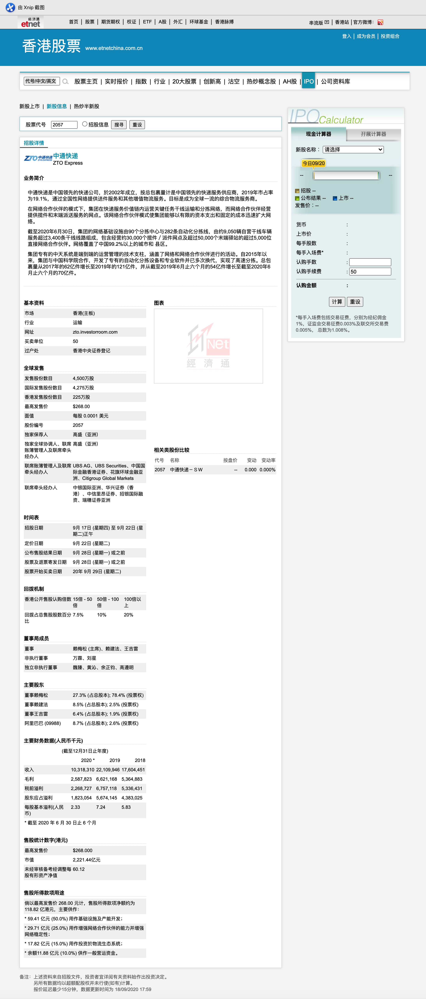
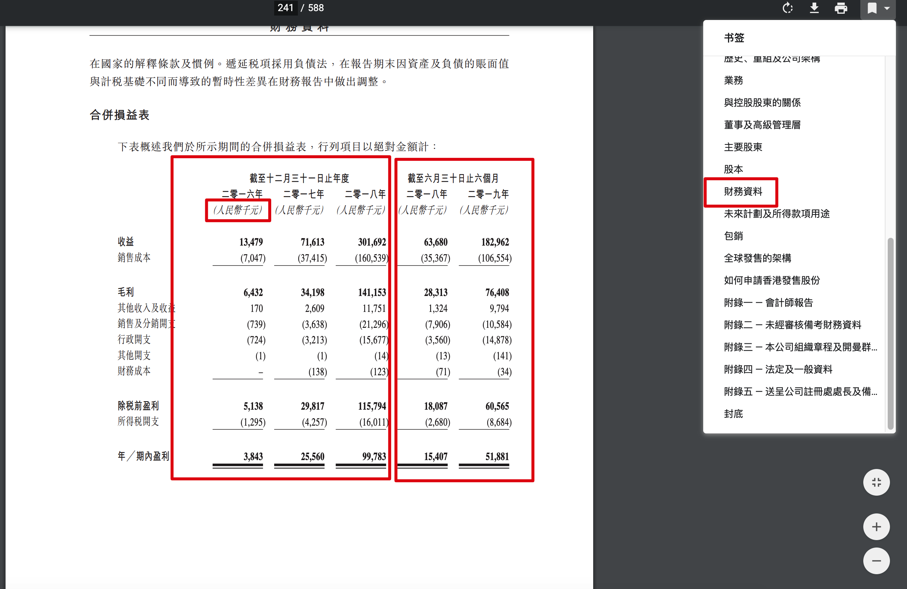
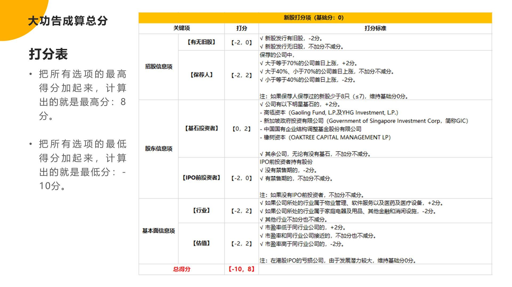

# 港股打新 

## 为什么打新能赚钱？

### 为什么公司要上市发行股票呢❓

1. 可以募集到大量资金
2. 可以提高公司的知名度
3. 可以吸引更多的投资者


#### **上市**，意味着公司得把一部分股份拿出来出售给投资者，让更多的人成为公司的股东！

⏰

```

IPO：公司第一次将他的股份向公众出售的这种行为，叫做首次公开慕股（Initial Publish Offering）

```

上市之后，证券交易所会要求公司定期公示财务情况，也就是每季度，每半年，每年发布财务报表。

几乎每个IPO市场都会出台有利于投资者的保护政策，吸引大家申购新股。

**A股市场**
```
在A股，证监会就规定，公司不得以高于23倍的市盈率发行新股。“市盈率低于23倍”代表公司的价格普遍便宜，这个政策几乎能确保每个投资者能获利。
```


**港股市场**
```
在港股，同样出台了偏向中小投资者的新股分配制度，申购同一只新股，公司会尽可能让所有人都分到一手。
```
⚠️ 打新本质上是一种套利行为，属于投机，而不是投资。

打新是为了公司能顺利上市，政府出台新政策，公司让利，吸引我们来申购新股。一旦公司上市成功，这个优惠就会很快消失。

### 不是所有的新股都会上涨


**破发**


```
新股上市之后的涨跌依旧会受到其他因素的影响，比如，公司突然发生什么丑闻，或者上市时卖出的人太多等等。这些负面因素，会对股价造成负面影响，严重的话，则会导致新股上市之后跌破发行价，俗称“破发”。
```

根据wind数据统计，全球的IPO市场，新股都是大概率上涨的。

## 在哪里开始打新策略？

1. **看首日上涨的概率**，A股上市99.999%首日上涨，台湾新股首日上涨率为90%，香港新股首日上涨概率为65%，美股80%首日上涨！ 
2. **中签难度**，中签的几率对打新来说非常重要，首日上涨最高的A股，中签的几率只有万分之几，港股稍微好点，股票的一手中签率在1%～100%，平均达到60%，随着参与港股打新的人越来越多，几率会有所下降。美股不会公布中签率，但是基本上是好股难中，烂股易中。台股中签难度大，平均中签不到4%。
3. **申购新股的资格**，我们在A股，港股，美股都能开通账户，拥有申购新股的资格，另外，A股有一万元市值的门槛，对股市新手不太友好！


**“炒新”**

```
在港股还有一个不具备的优势，那就是对公司炒作自家股票是默许的。
```
📖打新的三个特点：
1. 收益高
2. 盈利周期短
3. 本金少

---

#  传统券商🆚互联网券商

相比传统券商来说，互联网券商🈶️三个优点：

1. 开会速度快
2. 交易软件好用
3. 佣金优惠

### 寻找优质券商的三大要素

#### 挑选券商的三大技巧：


1. **是否可以融资打新**，融资打新的意思是我们从券商那里借钱打新，假如一家券商的融资倍数是10，那么1万元可以打10万元的新股，在新股多，但钱不够但时候就派上用场了。
2. **费用是否便宜**，打新需要但费用大致分为2种：
  - 第一种是**共同费用**：意思是指所有的券商都一样的费用，这种费用会在打新和新股卖出的时候产生，由香港证券交易所和香港证监会收取，例如：交易费，交易征费等；
  - 第二种是**差异费用**，指的是各个券商都不一样的费用，是由他们券商自己定制的，比如说：佣金，平台使用费，认购费，融资利息等。
3. **是否有暗盘**，暗盘是券商自己的交易系统，和港交所的正式交易系统类似，有了暗盘，就多一直卖出的选择。

### 掌握入金操作

#### 钱可以通过银行卡转到交易账户上，这个过程称为入金，反之是出金。

入金的方式有2种：

1. 境内银行卡入金，境内银行卡虽然方便，但是也有缺点：
  - 汇款不是100%成功，汇款过程中无论成败，银行都会收取手续费，如果失败了，可能损失几十甚至几百元
  - 出金很难，各大券商几乎都不支持境内银行卡出金
2. 香港本地银行卡入金
  - 优点是：入金速度快，基本当天就可以完成，
  - 缺点是：门槛高需要专门办理。

---

### 哪些新股可以打？

#### 专门的网站
1. [(披露易)](https://sc.hkexnews.hk/TuniS/www.hkexnews.hk/index_c.htm)查看
在披露易网站，点击上方的【新上市】，再点击【新上市资料】，就可以查看最近的招募的新股。

2. 在【新上市资料】下，有2个板块，分别是主板和GEM，GEM就是创业板，和A股类似，港股也分主板和创业板，分别对应不同规模的上市公司。
3. 点击【GEM】进入创业板主页，再点击【新上市资料】，就可以看到**即将上市**的登录创业板的新股。（如果表格中没有数据，那就代表目前没有正在招募的新股）
4. 进入披露易网站首页，点击上方的【新上市】，再点击【申请版本，聆讯后资料集及相关资料】可以看到正处于**上市筹备中**的公司


#### 去券商app（捷利交易宝）查看

1. 打开捷利交易宝app，在首页点击【新股通】，进入港股新股页面。
2. 查看即将上市的新股：在港股新股页面，找到【待上市】这个标题下的公司，就是即将上市的新股了。
3. 查看正在筹备阶段的新股：往下滑动，就可以看见【最新递表】，这一个标题下的新股就是目前**正在筹备中**的新股，点击【最新递表】右侧的三个小点，可以看到更加详细的处于筹备阶段的新股列表，新股列表还分为主板和创业板两个板块显示。

#### 新股的基本情况

1. 首先，是新股的股票名称和上市代号，其次是新股的上市市场--主板还是创业板！

```
主板和创业板最大的区别是对公司市值要求不一样，主板要求公司市值不能少于5亿港元，而创业板只要1.5亿股元，另外创业板是港股专门为中小企业设立的证券市场，公司小风险大，因此股交所对它的监管更加严格，比如要求披露更多的资料。股票代码以“08”开头的都是创业板上市公司。
```
2. 招股时间和上市时间：

    2.1 登录[经济通网站香港股票](http://www.etnetchina.com.cn/stocks)界面 ,点击页面上的【IPO】,可以看到所有的信息！如下图所示：
    

    2.2 在【即将上市信息】栏下，点击单个股票的名称，可以进入新股的详情信息页面，以中通快递为例，如下图所示，其中的时间表，有招股日期，其中**股票开始买卖日期**就是上市日期，
    

    
### 我们根据哪些关键项目来打分呢？

1. 是否有新瓶装旧酒；
2. 新股背后的推荐人；
3. 新股背后的投资人；
4. 新股的自身实力；

#### 新瓶装旧酒
指的就是新股发行的同时，卖掉旧股票。

#### 新股背后的推荐人
新股背后的推荐人是指保荐人机制
``` 
港股新股上市之前，必须要指定一位保荐人，保荐人好不好，某种程度上也决定了，新股上市的表现，
```
#### 新股背后的投资人
```
新股背后的投资人是指有些新股在上市发行时，部分股份会被投资人事先认购，有些新股在上市发行前就存在投资人，比如 ：天使投资人，A轮，B轮等，投资人的存在意味着对公司前景的看好，另一方面，我们也要注意他们是否会把股份卖出套现，所以这个情况不能一概而论，需要具体情况具体分析。
```

#### 新股的自身实力

新股的自身实力这里的含义比较丰富，比如，公司所处的行业就属于其中之一。
```
有些港股新股，虽然自身业绩一般般，但是行业热门，受追捧，所以，好的行业对我们来说也是加分项。

```

新股卖的贵不贵也值得关注，新股上市，就是要在市场上找买家，公司实力能达到同行的平均水平，但是卖的比同行便宜，就是竞争力。而我们申购新股，自然更加愿意购买便宜的新股，这样新股上涨的空间就会更大。所以**新股估值**也是我们需要考虑的一个方面。

总结：
    
1. 【有无旧股】和【保荐人】属于招股信息项
2. 【技石投资者】和【IPO前投资者】属于股东信息项
3. 【行业】和【估值】属于基本面信息项
   
---

###  新瓶装旧酒好不好？

**旧股**：公司在创建时候，为了筹集资本，就把股份卖给了投资人，这部分在上市前卖出的股份。

可能有2种情况：

1. 原来的股东继续持有不卖；
2. 老股东选择在新股发行的时候把自己的股票卖出转让给打新者。（有点跑路的意思）

👉 新股发行卖旧股属于减分项，减2分，如果没有旧股，则不加分

### 招股书

**招股书**也叫做，招股说明书，是公司公开发行股票时候，就招股事宜发布的书面通告。

登录[经济通](http://www.etnetchina.com.cn/stocks)网站香港股票界面 ,点击页面上的【IPO】,在【即将上市信息】这一栏，可以看到每个即将上市的招股书。点击即可打开查看，在招股书的【重要提示】下面，可以看到所有的招股信息，以中通为例：

1. 全球發售的發售股份數目 ： 45,000,000股發售股份（視乎超額配股權行使與否而定）
2. 香港發售股份數目 ： 2,250,000股發售股份（可予重新分配）
3. 國際發售股份數目 ： 42,750,000股發售股份（可予重新分配及視乎超額配股權行使與否而定）
4. 最高公開發售價 ： 每股發售股份268.00港元，另加1.0%經紀佣金、0.0027%香港證監會交易徵費以及0.005%香港聯交所交易費（須於申請時以港元繳足，多繳款項可退還）
5. 面值 ： 每股股份0.0001美元
6. 股份代號 ： 2057
7. 獨家保薦人、獨家全球協調人、聯席賬簿管理人及聯席牽頭經辦人

从以上的资料可以看出，中通没有旧股发行！在手机app**捷利交易宝**上也可以查看到！

如果上有旧股发行的新股会是如下情况👇
全球發售的發售股份數目 ： 352,700,000股股份（包括310,300,000股新股份
及42,400,000股銷售股份，視乎超額配股權
行使與否而定）
其中42,400,000股銷售股份，就是旧股，减分项。

### 保荐人是否靠谱

保荐人
```
简单点理解，保荐人就是公司上市的推荐人和担保人，通常由证券公司来承担这一角色，要获得保荐人资格，申请机构需要经过长达数月的审批流程和严格塞选。
在新股破发的时候，保荐人能够以不高于发行价的价格，低价买回市场上流通的新股股票，然后还给战略投资人。
```
靠谱的保荐人，在护盘的时候，会表现的比较积极，靠谱保荐人的持续买入，股价会稳定在一个较小的波动区间，不靠谱的推荐人就会假装没有看见，护盘不积极不说，有些甚至任由投资者集中卖出。

根据资金背景不同，保荐人可以分为三种：

1. 中资券商（中信里昂，建银国际）
2. 外资券商（高盛，摩根斯坦利）
3. 港资券商（创升融资，丰盛融资）

#### 推荐人是否靠谱需要拿过往业绩说话
如果他保荐的新股，上市首日上涨多，破发少，那么我们跟着他可能有肉吃，自然是比较靠谱的；

**保荐人打分标准**
1. 如果保荐的公司中，有占比>70%的公司首日上涨，则认为保荐人业绩优秀；
2. 如果保荐的公司中，有占比40%～70%的公司首日上涨，则认为保荐人业绩居中；
3. 如果保荐的公司中，有占比<40%的公司首日上涨，则认为保荐人业绩较差，减2分；

#### 怎么查看保荐人过往信息和业绩？

在捷利交易宝App里，任何一只新股的【简介】标签下，就能看到【保荐人】这项。点击蓝色的保荐人名字，就能查看他们的历史业绩。

保荐成绩（新股上涨率） = 上涨的新股数 / 总共保荐的新股数 

---

### 看后台

#### 基石投资者
基石投资者就是在IPO时，提前和发行人签订认购协议，以IPO的价格，也就是新股发行的价格认购一定股票数量的投资者，基石投资者认购的股票通常会有6～12个月的锁定期。
签订协议的时候，新股的发行价格是未知的，即使如此，基石投资者也愿意购买，体现了其坚定的信心。

#### 基石投资者队伍

第一队：高瓴资本（Gaoling Fund, L.p.），新加坡政府投资有限公司（GIC），中国国有企业结构调整基金股份有限公司和橡树资本，英文名，OAKTREE CAPITAL MANAGEMENTLP
第二队：普通企业或者个人投资者，经过对2019年对港股市场的数据回溯，发现普通基石投资者，对于降低新股破发概率的作用能力有限，所以，由这些投资者做基石投资者的公司，我们就和没有基石投资者的新股一样处理，不加分不减分！

### IPO前的投资者

IPO前投资者（VC，A轮投资者等）和基石投资者的区别：
1. 二者的进入时间不一样，IPO前投资者是在公司上市前进入的，而基石投资者是在IPO时进入的，后者属于IPO投资者。
2. 基石投资者买到的价格是IPO的价格，也就是新股发行价，而IPO前投资者买到的股票价格可不是发行价。

对于打新来说，应该关注【IPO前投资者】哪些方面？
鉴于IPO前投资者的成本低，只要IPO价格合理，就可以完成套现离场，因此，我们要重点关注的是，在上市首日那天，是否被运行卖股票。

**IPO前投资者打分标准**：IPO前投资者持有股份，如果有禁售期，不加分不减分，如果没有禁售期，减2分。

在【招股书】中的 **歷史、重組及公司架構**这一页可以看见禁售期这项，以[驴技科技](http://www.etnet.com.hk/corpan_cache/get_file.php?n=d755EWRu2kx5UEhu16zZm8fHdfONfUPwtkVrikKcuuBJWpMHo7YyhuVwOc0ihG7CixnQA1gSEcpwa0W0TB5vv50),公司股票代码为[01745]为例,可以看见，部分股东有禁售期，其他的没有禁售期。

### 行业信息打分标准

从2019年港港新港数据来看，物流管理，软件服务以及医疗和医疗设备，比较受行业的青睐。
对于【行业】这项的打分，需要根据市场动向灵活变换。但是行业信息哪里找呢？

1. [经济通](http://www.etnetchina.com.cn/stocks)，进入网站=>点击【IPO】=>输入【股票代码】=>点击【搜寻】=>点击【代号】=>进入【基本信息】界面,就能看见所属【行业】
2. 也可以在【招股书】中的【行业概览】中查看

---

### 估值计算要牢记
判断公司是否便宜：
1. 算出新股发行时候的市盈率；
2. 找到和新股同一个行业的公司并且查看他们的市盈率；
3. 把新股市盈率和同行业的其他公司的市盈率进行对比，判断新股的估值是贵还是便宜。

如果市盈率低于同行的 +2分，市盈率接近的不加分不减分，市盈率高于同行的，-2分。


#### 算出新股发行时候的市盈率

下图是在新股【招股书】上的截图，注意看下图的红色圈出来的，左边是截至12月31日就是全年净利润 ，右边是截至6月30日就是半年净利润，单位是千元，也就是说2018年上半年的净利润是 15407*1000元港币。  

市盈率（PE） = 市值 / 净利润

1. 第一种（静市盈率）是以全年的净利润数据来计算：市盈率 = 中间市值 / 2019年全年净利润 
2. 第二种（TTM也就是滚动市盈率）是：市盈率 = 中间市值/（2018年下半年净利润+2019上半年净利润）


```
在最近一年净利润数据可以获取的情况下，用第二种方法计算更加准确，第一种计算也行。
```

#### 找到和新股同一个行业的公司并且查看他们的市盈率

在经济通网站上，找到这只新股的【新股信息】界面，往下滑动，寻找右侧的【相关类股份比较】，就能看到同行的信息，选择3～5只同行，分别查看他们的市盈率是多少。同行市盈率可以在**富途App**上输入对应的股票代码进行查看

⚠️注意：比较的时候，一定要在同一时间进行比较，要不然没有意义。

最后将新股市盈率和同行市盈率由高到低进行估值比较，如果同行中市盈率排名最低可以➕2分。




**如果遇一些打分比较低的公司，但是前景发展比较好（比如阿里巴巴，九毛九等 ），可以给0分。**


#### 总结

如果你是激进类型的，可以在新股打分是-2分的时候，进行打新，如果是保守的可以在0分以上进行打新。

---

### 打一手新股需要多少钱💰？

在券商app上，进入你想购买的这只新股的页面，有点需要注意：

1. 招股价：招股价显示的是一个区间，分别是上限和下限，最终的发行价是这个区间中的一个值，但是这个值具体是多少，在申购的时候并不知道。
2. 每手股数：就是每股多少股的意思，A股每手100股 ，但是港股不是，港股每手股数由发行人说了算。一般是在100～20000之间
3. 最低认购：俗称“入场费”，也就是申购一手所需要的钱

以“兴业物联”为例：

```
定价上限是2元 X 每手2000股 = 入场费4000 元
中签费 = 中签的最高市值4000元（即入场费） x 1.0027% = 40.31元
1.0027% = 1%的经济佣金 + 0.0027%是监证费 + 0.005%是联交所交易费用
这笔中签费会在申购的时候，由券商一并冻结，中签后会交给港交所和证监会。
```

入场费 = 招股价上限 x 每手股数 + 中签费

**所以入场费：（1+1.0077%）x 招股价上限 x 每手股数**

但是，这 并不是最终要交的钱，还要在入场费基础上加上**认购手续费**，一般是50港币左右 ！

如果中签了，公司发行价就能确定好了，入场费中结余的钱会退回到你的账户上 。如果没有中签，券商会把入场费原封不动的退回给你。**但是无论是否中签，券商都会收取认购手续费**


```
融资认购：就是借钱申购，虽然能提高中签率，但是，如果新股破发，会有强行平仓的风险。
```

什么是强行平仓？

当你借钱申购的新股破发了，券商会担心你还不上钱，通常会让你先追加保证金，如果保证金无法及时到位，就会替代你把全部股票卖掉还钱。

所以：对于新手打新来说，还是**现金认购**比较好。一般保守一点，建议申购**一手**比较好！


### 招股期会发生一些什么事情呢？

1.  孖展

“孖展”一词来自香港，英文为Margin，即[保证金](https://baike.baidu.com/item/保证金/650093)的意思。在香港市场上，银行和[证券公司](https://baike.baidu.com/item/证券公司/2451707)一般向投资者提供融资服务。开设了“孖展账户”的投资者，在进行股票买卖时，可利用他们提供的融资额进行杠杆投资，放大收益。一般情况下，证券行或银行向投资者提供这种服务会收取一定的利息。

在招股期间，有个和孖展相关的信息需要我们关注，那就是**孖展倍数**，所谓孖展倍数，就是在招股期内，券商总共借给投资者的钱，比上公开发售集资额的倍数，然后减去一，因此也叫做超购倍数 。这个数字意味着新股的热门程度。

一般来说超购倍数超过100倍算是比较高的，这个指标在捷利交易宝app中可以看到。


2. 抽飞

也就是取消认购的意思，不买了。如果一只新股在你购买之后的招股期内，发现孖展显示借出的金额相比购买的时候骤降了1亿元以上，那么，可能是发生抽飞了，也是市场对这个新股由看好到看淡的转变，那么需要重新估价打分，考虑是否需要撤销申购！

